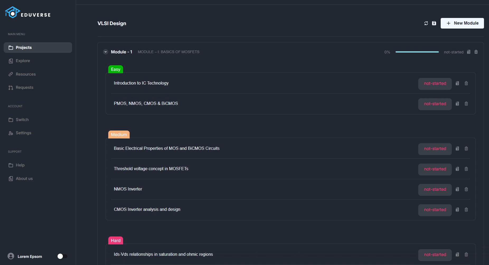

# AI-Powered Full Stack Applications

 

  
Table of Contents

  <ol>
    <li>
      <a href="#Eduverse">Eduverse Student Companion</a>
    </li>
    <li>
      <a href="#cinepick">Cinepick Movie Website</a>
    </li>
    <li>
      <a href="#hack-stack">Hack/Stack</a>
    </li>
    <li>
      <a href="#movie-synopsis-search">Movies Website</a>
    </li>
  </ol>

 

## Eduverse Student Companion

### About The Project

Eduverse is an AI-Powered desktop application designed to help users create, manage, and share personalized learning roadmaps and study resources for any skill they wish to acquire. Whether you're learning to code, play an instrument, or master a new language, Eduverse simplifies the process by providing  structured roadmaps, resource management, and social sharing capabilities.

### Built With

![electron] ![nodejs] ![React.js] ![mongodb] ![openai]

## Cinepick Movie Website

`Click Image -> Repo`

### About The Project

CinePick is a modern, full-featured movies website built using Spring Boot, FastAPI, React.js and Langchain. It provides a smooth user experience with dynamic content tailored to the user’s location and preferences. From searching and filtering movies to booking seats and getting personalized movie recommendations, CinePick offers it all!

### Built With

![spring] ![React.js] ![scikitlearn] ![tensorflow] ![langchain] ![fastapi]

 

## Hack Stack

`Click Image -> Repo`

### About The Project

This is a `React` and `Django` Application for analyzing your coding performance using interactive plots and generating necessary recommendations.

### Built With

![Django] ![React.js] ![HTML] ![CSS] ![Bootstrap] ![scikitlearn] ![tensorflow]

 

## Movie Synopsis Search

`Click Image -> Repo`

### About The Project

In this project we have implemented an `AI Powered Search Engine` for a Movies Website that can a search a movie using its Plot, Name or Cast and Crew.

### Built With

![Django] ![HTML] ![CSS] ![Bootstrap] ![scikitlearn] ![tensorflow]

[Django]:https://img.shields.io/badge/Django-black?style=for-the-badge&logo=django
[HTML]:https://img.shields.io/badge/HTML-grey?style=for-the-badge&logo=html5
[CSS]:https://img.shields.io/badge/CSS-blue?style=for-the-badge&logo=css3
[Bootstrap]:https://img.shields.io/badge/Bootstrap-563D7C?style=for-the-badge&logo=bootstrap&logoColor=white
[React.js]: https://img.shields.io/badge/React-20232A?style=for-the-badge&logo=react&logoColor=61DAFB
[scikitlearn]:https://img.shields.io/badge/Scikit--Learn-white?style=for-the-badge&logo=scikit-learn
[tensorflow]:https://img.shields.io/badge/Tensorflow-black?style=for-the-badge&logo=tensorflow
[spring]:https://img.shields.io/badge/Spring--Boot-249141?style=for-the-badge&logo=spring&logoColor=white
[rabbitmq]:https://img.shields.io/badge/RabbitMQ-orange?style=for-the-badge&logo=rabbitmq&logoColor=white
[postgres]:https://img.shields.io/badge/PostgreSQL-blue?style=for-the-badge&logo=postgresql&logoColor=white
[langchain]: https://img.shields.io/badge/Langchain-black?style=for-the-badge&logo=langchain
[fastapi]: https://img.shields.io/badge/FastAPIt-blue?style=for-the-badge&logo=fastapi&logoColor=white
[openai]: https://img.shields.io/badge/Openai-black?style=for-the-badge&logo=openai
[electron]: https://img.shields.io/badge/Electron-2B2E3A?style=for-the-badge&logo=electron
[mongodb]: https://img.shields.io/badge/MongoDB-white?style=for-the-badge&logo=mongodb
[nodejs]: https://img.shields.io/badge/Node.js-green?style=for-the-badge&logo=node.js
